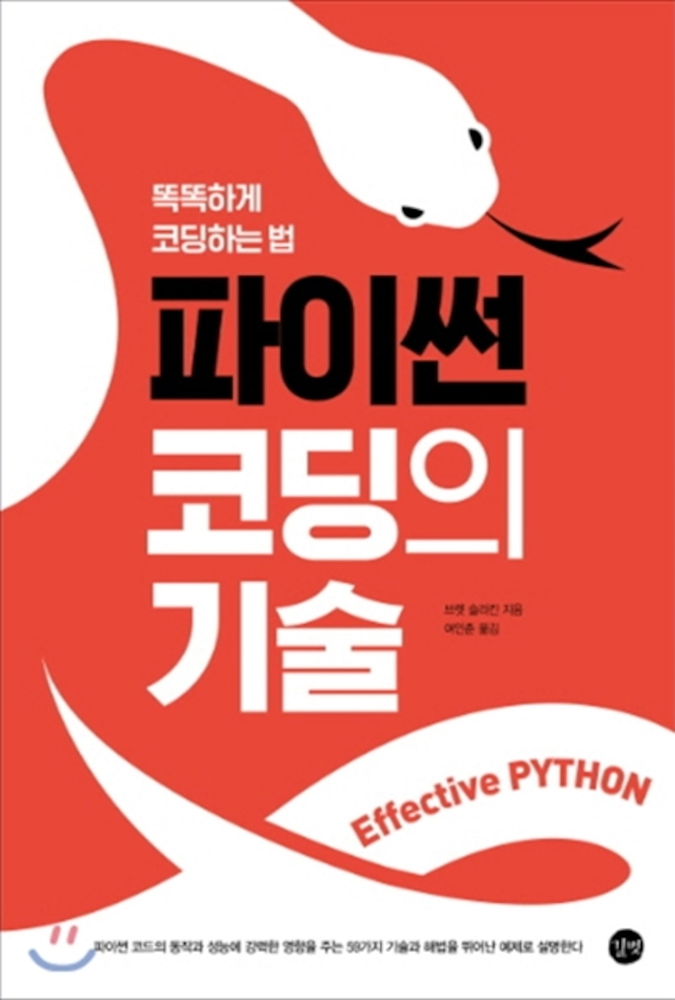

# Effective Coding PYTHON

## [Chap 1: 파이썬다운 생각](Chap%201:%20Think%20as%20PYTHON/README.md)
## [Chap 2: 함수](Chap%202:%20Function/README.md)
## [Chap 3: 클래스와 상속](Chap%203:%20Class%20&%20Extend/README.md)
## [Chap 4: 메타클래스와 속성](Chap%204:%20Metaclass%20&%20Property/README.md)
## [Chap 5: 병행성과 병렬성](Chap%205:%20Concurrency%20&%20Parallelism/README.md)
## [Chap 6: 내장 모듈](Chap%206:%20Built-in%20module/README.md)
## [Chap 7: 협력](Chap%207:%20Cooperation/README.md)
## [Chap 8: 제품화](Chap%208:%20Commercialization/README.md)

---
EFFECTIVE PYTHON: 59 SPECEFIC WAYS TO WRITE BETTER PYTHON
Authorized Translation from English language edition, entitled EFFECTIVE PYTHON: 59 SPECIFIC WAYS TO WRITE BETTER PYTHON, 1st Edition by BRETT SLATKIN, published by Pearson Education, lnc, publishing as Addison-Wesley Professional, Copyright (C) 2015 EFFECTIVE PYTHON: 59 SPECEFIC WAYS TO WRITE BETTER PYTHON.

All rights reserved. No part of this book may be reproduced or transmitted in any form or by any means, electronic or mechanical, including photocopying, recording or by any information storage retrieval system, without permission from Pearson Education, lnc.

Electronic KOREAN language edition published by GILBUT PUBLISHING CO., LTD., Copyright (C) 2016.
___

### 참조: 똑똑하게 코딩하는 법 파이썬 코딩의 기술

